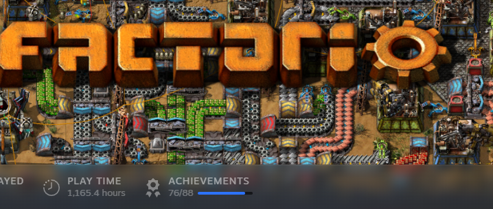

# Welcome to my GitHub profile!

🎓 I'm a Computer Science undergrad 

🎮 Currently working on:

- A multi-agent reinforcement learning project for my dissertation 🤖
- An automated stock trading system using Python & PyTorch 📈
- A procedural maze type dungeon game using Unreal Engine + multiplayer support
- https://circuit-lab.co.uk/

🛠️ Tech Stack:
- **Languages:** Python, C++, Kotlin, JavaScript
- **Tools & Frameworks:** PyTorch, Unity, Android, Flask, Node.js, Git
- **Specialties:** Game dev, AI/ML, Reinforcement Learning, System Design

💡 Interests:
- Game AI & mechanics design
- Financial markets & algo trading
- Multi-agent systems & strategy simulation
- Learning C++ but perfecting Python

<!-- GitHub Stats -->

<!-- Snake animation -->
<picture>
  <source media="(prefers-color-scheme: dark)" srcset="https://raw.githubusercontent.com/Arun-g03/Arun-g03/output/github-contribution-grid-snake-dark.svg" />
  <source media="(prefers-color-scheme: light)" srcset="https://raw.githubusercontent.com/Arun-g03/Arun-g03/output/github-contribution-grid-snake.svg" />
  
</picture>

### 🧠 So you know I'm serious about my work:

  
   
  <em>⏱️ 1,165.4 hours | 🏆 76/88 achievements | Factory must grow.</em>

